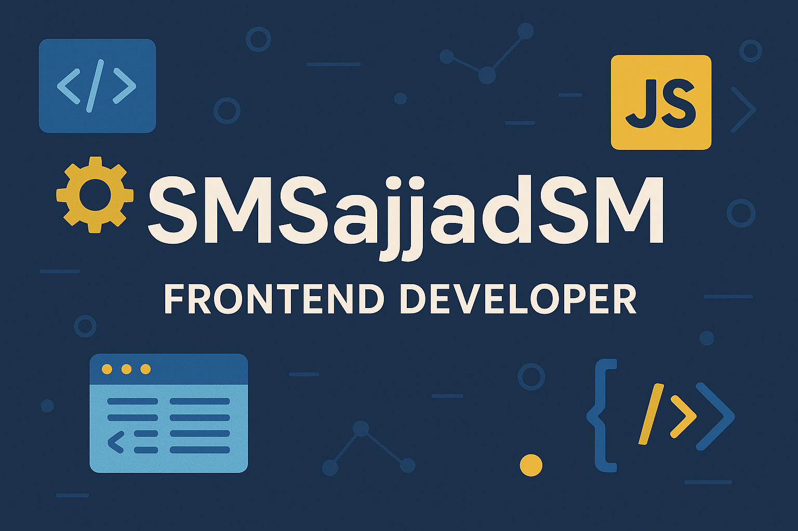

  

<h1 align="center">Hi 👋, I'm Sajjad Siadati</h1>

  

---

### 👨‍💻 About Me

- 🌱 I’m currently focused on mastering **React** and modern frontend tools like **Tailwind CSS**.
- 💬 Ask me about anything related to **Vanilla JS, HTML, CSS, and Git**. I'm always happy to help!
- 📫 You can reach me at: **Sajjadsiadati1390@gmail.com**

<h3 align="center">Connect with me:</h3>

  
  

<h3 align="center">Languages and Tools:</h3>

  
  
  
  
  
  
  
  

<h3 align="center">📊 My GitHub Stats</h3>
<table align="center" border="0" cellpadding="0" cellspacing="0">
  <tr align="center">
    <td>
      
    </td>
    <td>
      
    </td>
  </tr>
</table>

  

  

